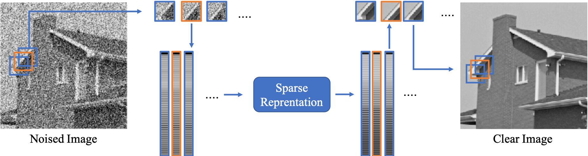
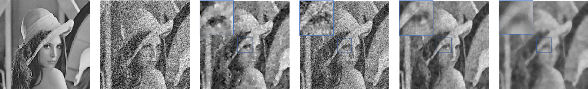
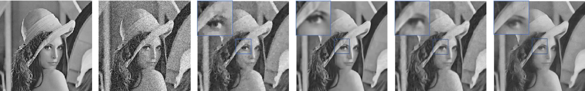

# Group-Based-Sparse-Representation-for-Image-Denoising
In this project, we try to gather nonlocal self-similar patches into a group(**findnlblock.m**) and solve a LASSO problem with ADMM(**ADMM.m**) using SVD dictionary, which can be run with the file **GBsimple.m**. Finally, we take Peak Signal to Noise Ratio (PSNR) as a kind of objective measurement of image quality and get the results with file **main.m** and use methods TV, BM3D, K-SVD and Wiener Filter as comparisons.
## Flowchart  
The flowchart can be seen as below, and it shows the process of one iteration in our algorithm. When one iteration ends, we need to pick another target patch(this new patch is usually parallel with the previous one) and set a new searching window to begin the next iteration, the distance between this new target patch and the previous target patch is called step size.  

## Results
The comparisons between different methods are shown as below:

  

  
From left to right, it shows original, denoised images, and images after total variation, BM3D, K-SVD and our proposed method. 
  

Experiment results of Lena with _&sigma;_ = 0.1 
  
  

Experiment results of Lena with _&sigma;_ = 0.01 

## Conclusion
We can clearly see that the method we proposed perform pretty well in processing details and high noise environment. Also, there is no need for us to train extra dictionary so that its information utilization is pretty high via non-local similarity. However, there are some problems that its running speed is relatively slow and final results are not so good as expected.
